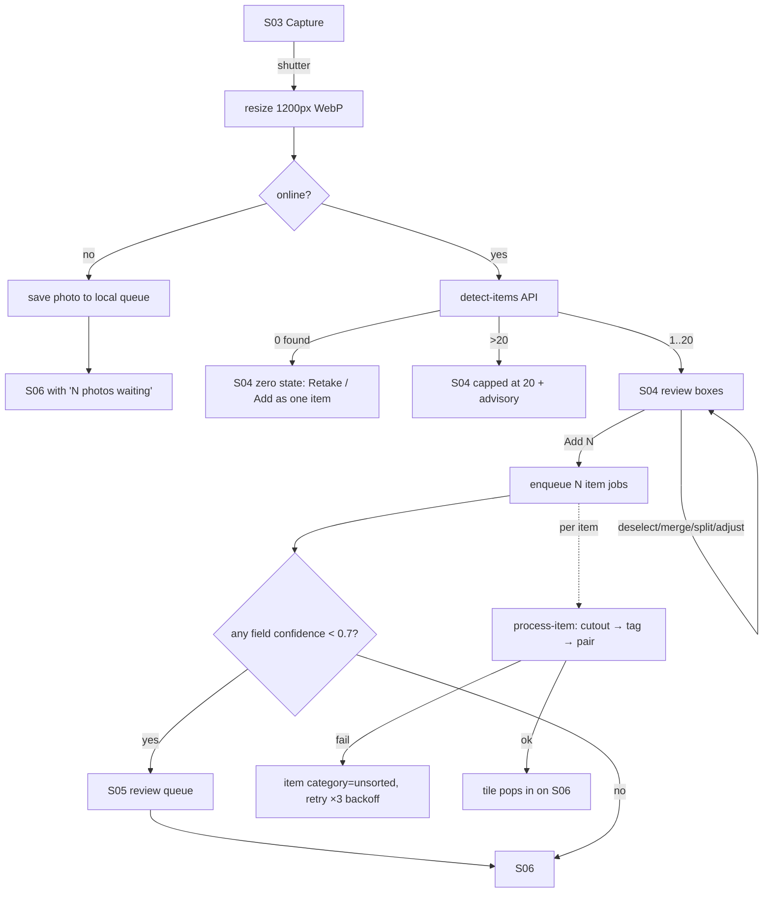
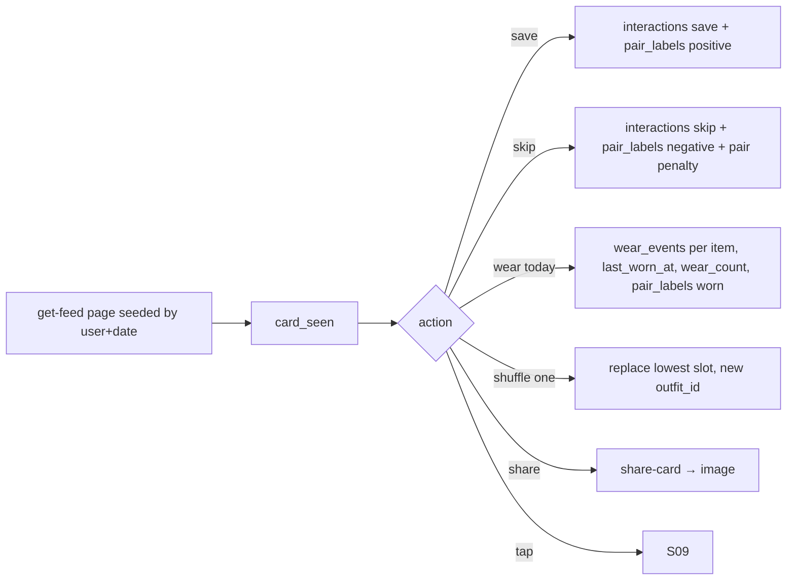
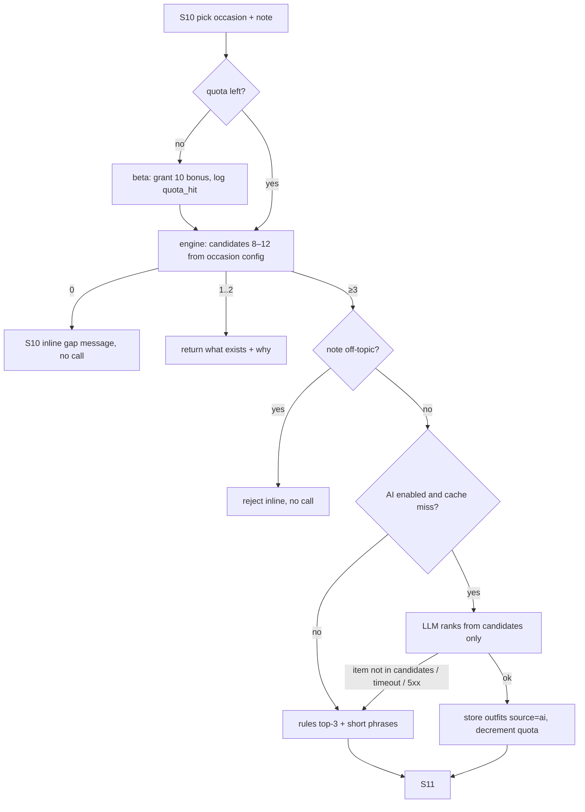
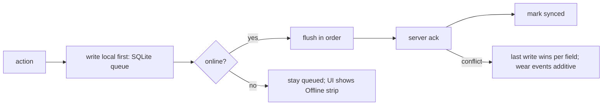

# Flows

## Add clothes (Path A) — happy path and every exit

```mermaid
flowchart TD
  A[S03 Capture] -->|shutter| B[resize 1200px WebP]
  B --> C{online?}
  C -->|no| C1[save photo to local queue] --> C2[S06 with 'N photos waiting']
  C -->|yes| D[detect-items API]
  D -->|0 found| E[S04 zero state: Retake / Add as one item]
  D -->|>20| F[S04 capped at 20 + advisory]
  D -->|1..20| G[S04 review boxes]
  G -->|deselect/merge/split/adjust| G
  G -->|Add N| H[enqueue N item jobs]
  H --> I{any field confidence < 0.7?}
  I -->|yes| J[S05 review queue] --> K[S06]
  I -->|no| K
  H -.per item.-> L[process-item: cutout → tag → pair]
  L -->|fail| M[item category=unsorted, retry ×3 backoff]
  L -->|ok| N[tile pops in on S06]
```

## Feed card lifecycle

```mermaid
flowchart LR
  A[get-feed page seeded by user+date] --> B[card_seen]
  B --> C{action}
  C -->|save| D[interactions save + pair_labels positive]
  C -->|skip| E[interactions skip + pair_labels negative + pair penalty]
  C -->|wear today| F[wear_events per item, last_worn_at, wear_count, pair_labels worn]
  C -->|shuffle one| G[replace lowest slot, new outfit_id]
  C -->|share| H[share-card → image]
  C -->|tap| I[S09]
```

## Occasion stylist — deterministic first

```mermaid
flowchart TD
  A[S10 pick occasion + note] --> B{quota left?}
  B -->|no| B1[beta: grant 10 bonus, log quota_hit] --> C
  B -->|yes| C[engine: candidates 8–12 from occasion config]
  C -->|0| C0[S10 inline gap message, no call]
  C -->|1..2| C1[return what exists + why]
  C -->|≥3| D{note off-topic?}
  D -->|yes| D1[reject inline, no call]
  D -->|no| E{AI enabled and cache miss?}
  E -->|no| F[rules top-3 + short phrases]
  E -->|yes| G[LLM ranks from candidates only]
  G -->|item not in candidates / timeout / 5xx| F
  G -->|ok| H[store outfits source=ai, decrement quota]
  F --> I[S11]
  H --> I
```

## Offline sync

```mermaid
flowchart LR
  A[action] --> B[write local first: SQLite queue]
  B --> C{online?}
  C -->|yes| D[flush in order] --> E[server ack] --> F[mark synced]
  C -->|no| G[stay queued; UI shows Offline strip]
  E -->|conflict| H[last write wins per field; wear events additive]
```
